# Clara Network

**An open-source card payment network you can run on your machine** — the
scheme (network) operator, the issuer, and the acquirer, end to end.

Clara Network is a working simulation of a Mastercard/Visa-style four-party
payment network: an ISO 8583 switch that routes authorizations by BIN,
clearing and net settlement with prefunded member accounts, a double-entry
ledger, card issuing with EMV-style cryptograms and network tokens, merchant
acquiring, a disputes engine, an HSM simulation with dual-control key
ceremonies, issuer stand-in processing with circuit breakers, and instant
payments (pacs.008 RTP). It ships with a read-only Admin API and a live
**web admin console** where you sign in as a Scheme Operator, Issuer, Acquirer,
Merchant, or Viewer and watch the whole network move.

It is not a toy dashboard: every screen reads from the same PostgreSQL schema
the switch, clearing engine, and sims write to. The repository also holds the
**research and specification library** under [`docs/`](./docs/) — 27 documents
covering ISO 8583, ISO 20022, EMV, tokenization, PCI DSS, interchange
economics, scheme governance, and the full system design blueprint.

| | |
|---|---|
| **Live demo** | https://clara-network.vercel.app (pick a persona — no typing) |
| **Docs** | [`docs/00-README.md`](./docs/00-README.md) — start here |
| **Build blueprint** | [`docs/25-clara-network-system-design.md`](./docs/25-clara-network-system-design.md) |
| **Status** | v0.1.0-beta — all ten blueprint phases implemented, [`make smoke`](#smoke-testing) verifies the stack end to end |
| **License** | [MIT](./LICENSE) |

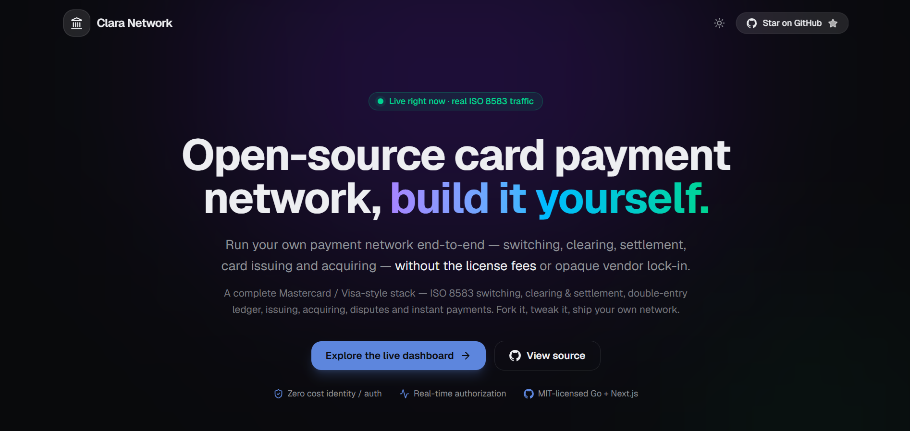

*The landing page — one click from here to a signed-in operator seat.*

## Why Clara Network

Payment-network internals are locked behind scheme memberships, certifications,
and NDAs, so almost nobody gets to read — let alone run — the machinery. Clara
Network opens it up:

- **It runs on your machine.** One `docker compose up` boots the switch, the
  issuer/acquirer/clearing/ledger/card/disputes/HSM/resilience/instant sims,
  PostgreSQL, and Redis. No scheme backend sits in the middle; the network is
  the code in this repo.
- **It speaks the real standards.** ISO 8583 authorizations on the wire,
  ISO 20022 pacs.008/pacs.009 for instant payments and settlement, EMV-style
  ARQC cryptograms with ATC anti-replay, ISO 9564 PIN blocks, ISO 9797-1 retail
  MACs, TR-31-style key blocks.
- **It shows its work.** Every authorization lands in an audit log, every net
  position posts as a balanced journal entry, every settlement instruction is
  inspectable XML, and the Admin API exposes all of it.
- **It fails realistically.** Member defaults draw on the default fund,
  issuer outages trip circuit breakers and fall back to stand-in processing,
  reconciliation catches a corrupted statement, and disputes move through
  representment to arbitration with SLA deadlines.
- **It is documented like a scheme.** The docs library is not API reference —
  it is the operating manual a real network's members would read, from BIN
  numbering to chargeback reason codes to PFMI oversight principles.

## Features

| Area | What you get |
|------|--------------|
| Switch | ISO 8583 authorization switching with BIN-based routing (DE100 or BIN table), per-issuer failover lists, idempotent replay protection |
| Risk | In-path velocity rules (per card / per merchant) counted in Redis with configurable decline codes |
| Clearing & settlement | Clearing file capture, per-member net positions, prefunded caps, default fund for member defaults, ISO 20022 pacs.009 settlement instructions |
| Ledger | Append-only double-entry journal, reconciliation against the settlement agent's statement with mismatch classification |
| Issuing | BIN ranges, card personalization, EMV-style ARQC verification with ATC anti-replay, token vault (PAN → token + PAR), mobile-wallet provisioning |
| Acquiring | Merchant boarding with MATCH/OFAC negative-list screening, MCC risk tiering, fee withholding, rolling reserves, scheduled payouts |
| Disputes | Reason-code taxonomy, file → representment → rule → arbitration lifecycle, associated-transaction check, SLA tracking, chargeback-ratio monitoring |
| Key management | HSM simulation: dual-control M-of-N key ceremonies, AES key wrap (RFC 3394), TR-31 key blocks, PIN blocks (formats 0/4), retail MACs, rotation, audit, dual-control zeroize |
| Resilience | Stand-in processing (SIP/STIP) with per-issuer limits and negative/valid-card files, circuit breakers with half-open probing, p99 latency metrics, 91-burst outage detection |
| Instant payments | pacs.008 credit transfers settled 24/7/365 against prefunded positions, 20-second SLA, verify-and-reserve capacity checks, AC04/AC01/AG01/FF01 rejections, pacs.002 status reports |
| Admin API | Read-only REST service (`:8083`) over the shared PostgreSQL schema — transactions, clearing, settlement, ledger, cards, tokens, merchants, disputes |
| Web console | Next.js dashboard on Vercel + Supabase + Railway with one-click persona login and per-role page access |

## Screenshots

Sign in by picking a persona — the console gates every page by role, so each
seat sees a different network. All screenshots are full size in
[`docs/screenshots/`](./docs/screenshots/).

### Getting in

| | |
|---|---|
| 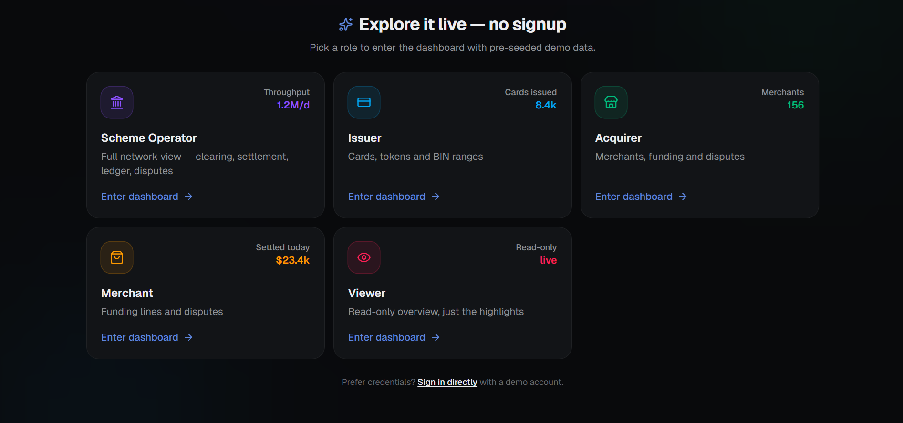 |  |
| **Persona login** — pick Scheme Operator, Issuer, Acquirer, Merchant, or Viewer and you are signed in instantly, no typing. | **Landing page** — the front door, with the persona picker one click away. |

### Scheme operator

| | |
|---|---|
| 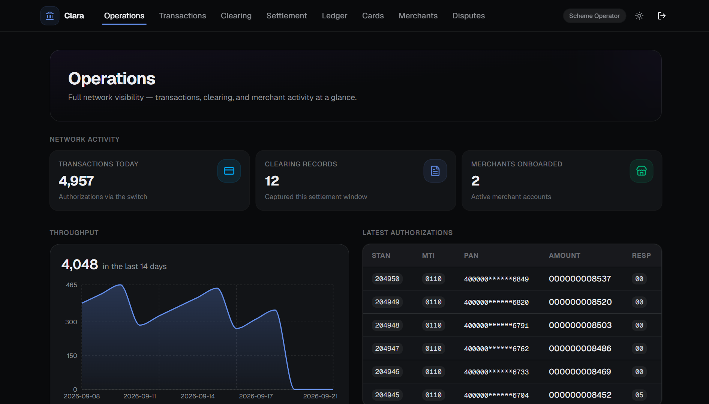 | 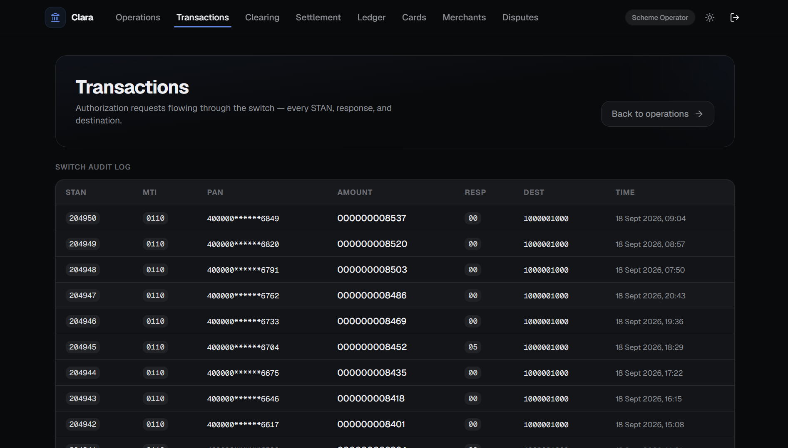 |
| **Operations dashboard** (`/ops`) — the whole network at a glance: transaction, clearing, merchant, dispute, card, and token counts. | **Transactions** — the switch's authorization audit log, filterable by status and currency. |
| 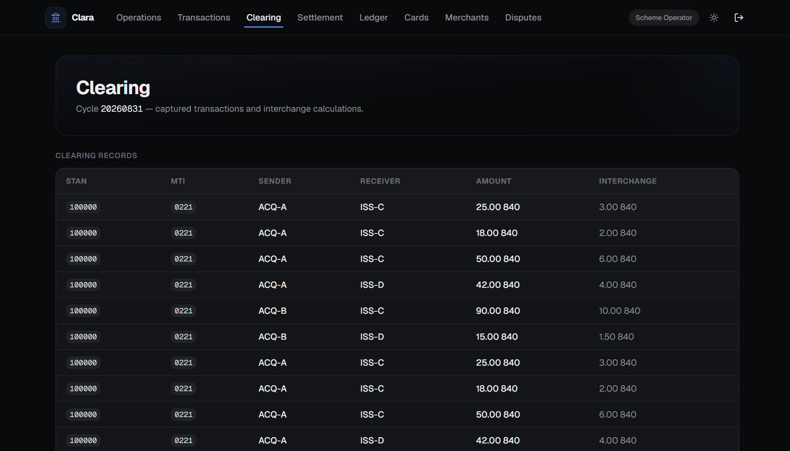 | 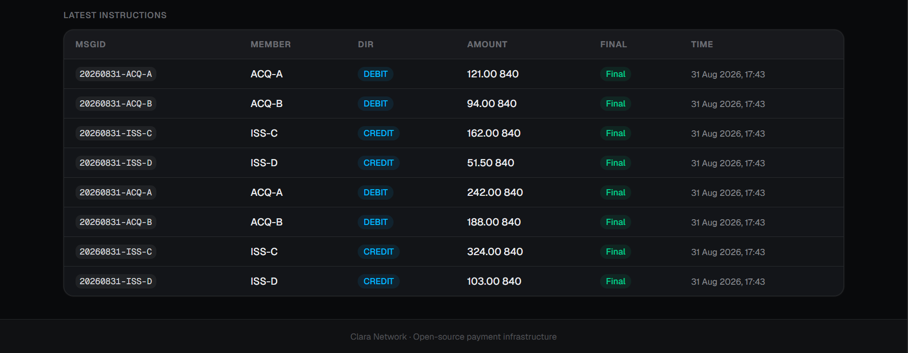 |
| **Clearing** — clearing cycles with per-member net positions. | **Settlement instructions** — the pacs.009 XML instructions that move money between members. |
| 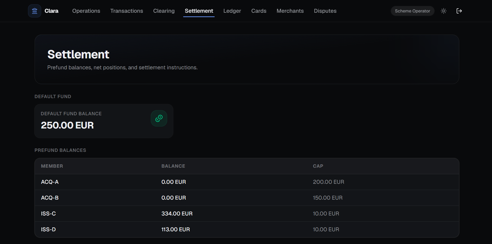 | 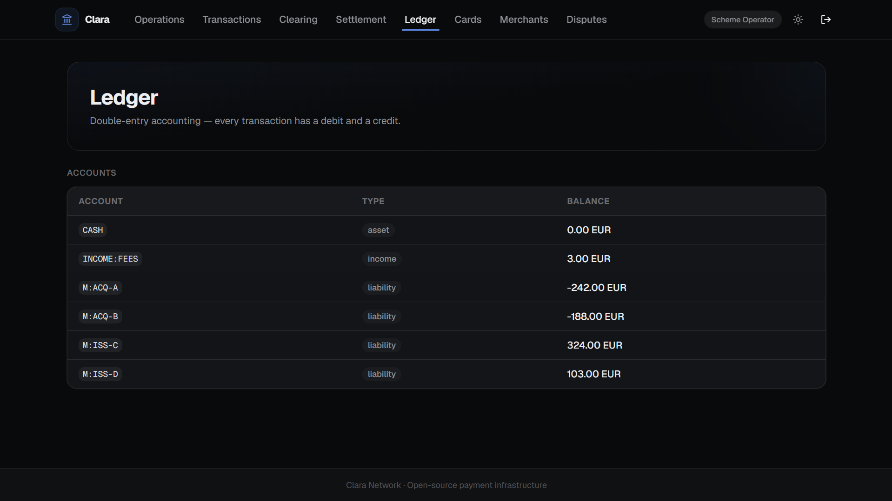 |
| **Settlement** — prefund account balances against caps, default fund, and settlement instructions. | **Ledger** — the append-only double-entry journal with computed balances per account. |
| 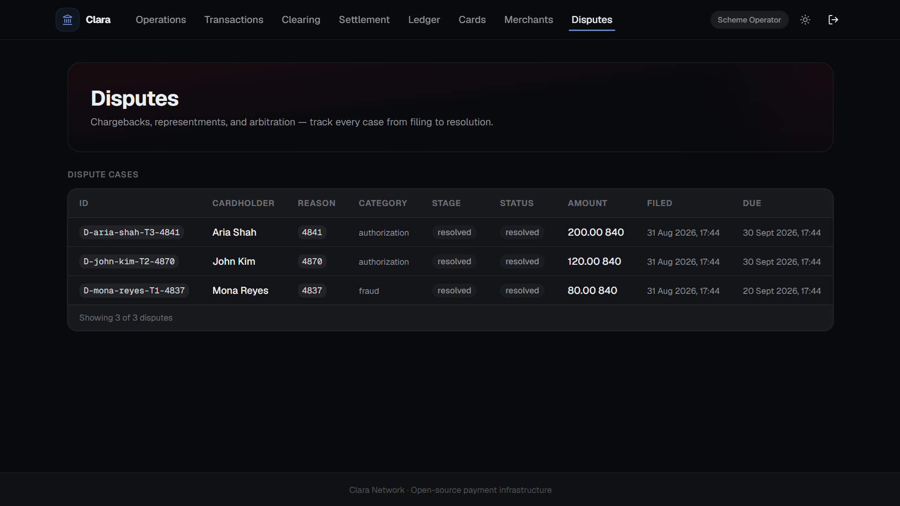 | 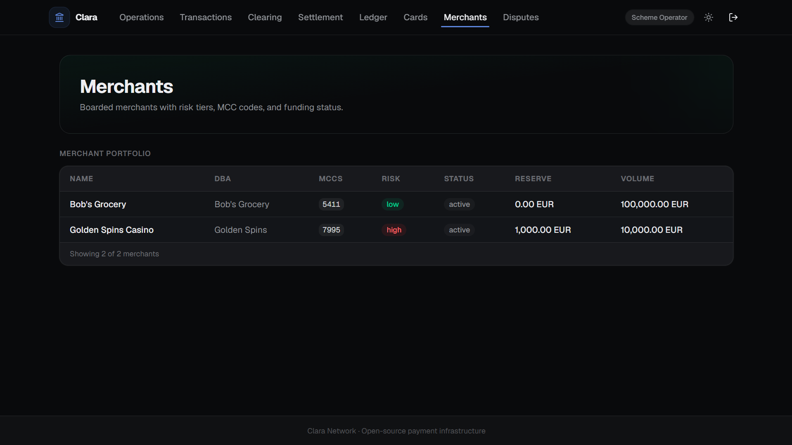 |
| **Disputes** — reason codes, lifecycle stage, SLA deadlines, evidence, and fees across all members. | **Merchants** — boarded merchants with MCC, risk tier, reserves, and limits. |

### Issuer

| | |
|---|---|
| 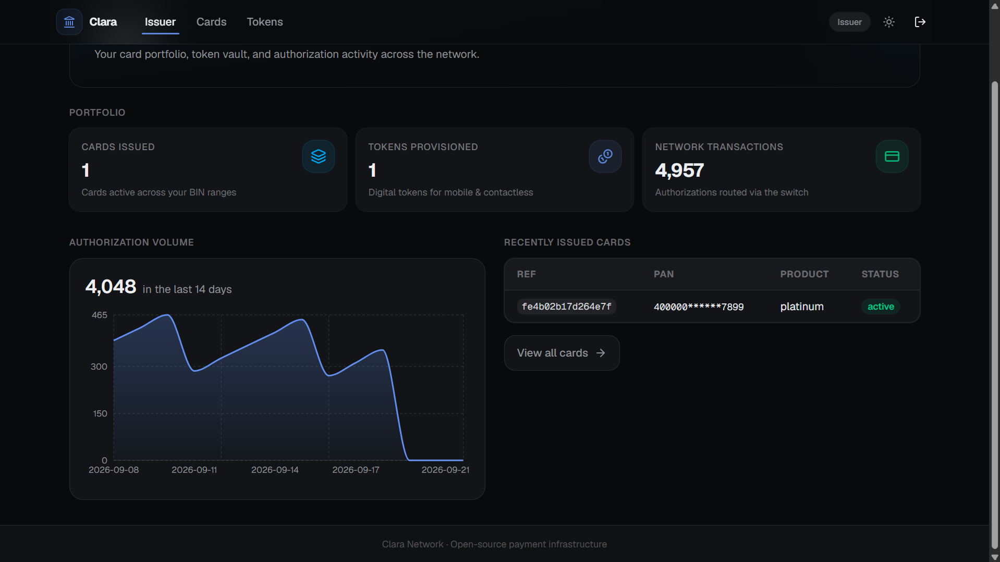 | 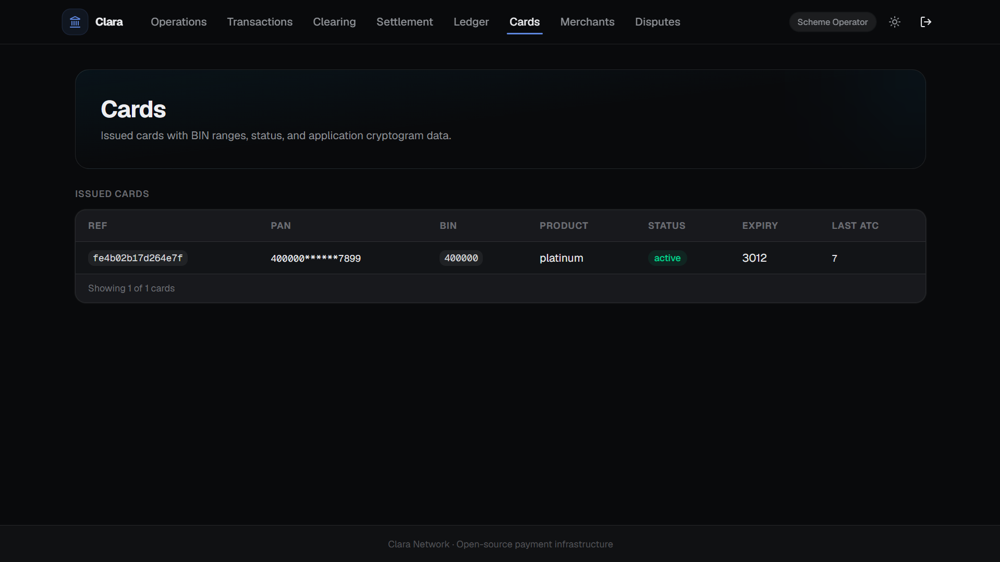 |
| **Issuer dashboard** (`/issuer`) — the issuer's portfolio: cards, tokens, and authorization activity. | **Cards** — issued cards with masked PAN, status, product, and the ATC anti-replay counter. |
| 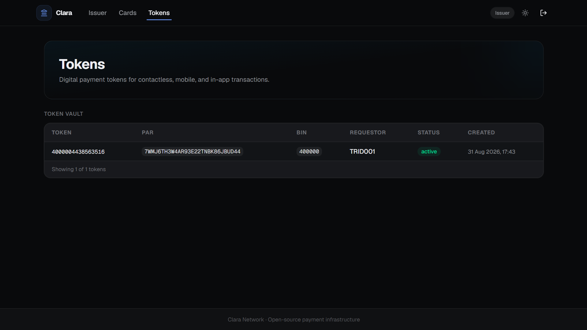 | |
| **Tokens** — network tokens with PAR, device, and requestor provenance from the token vault. | |

### Acquirer

| | |
|---|---|
| 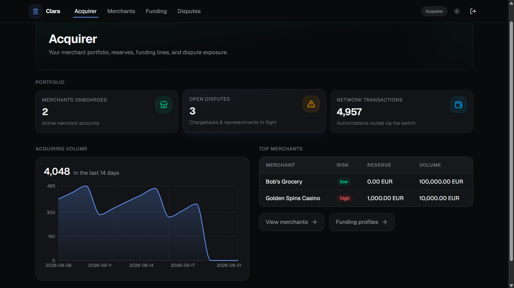 | 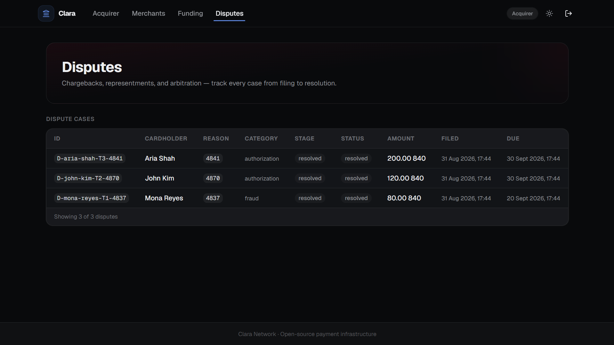 |
| **Acquirer dashboard** (`/acquirer`) — the acquirer's book: merchants, funding lines, and dispute exposure. | **Disputes** — chargebacks against the acquirer's merchants, with representment deadlines. |

### Viewer & activity

| | |
|---|---|
| 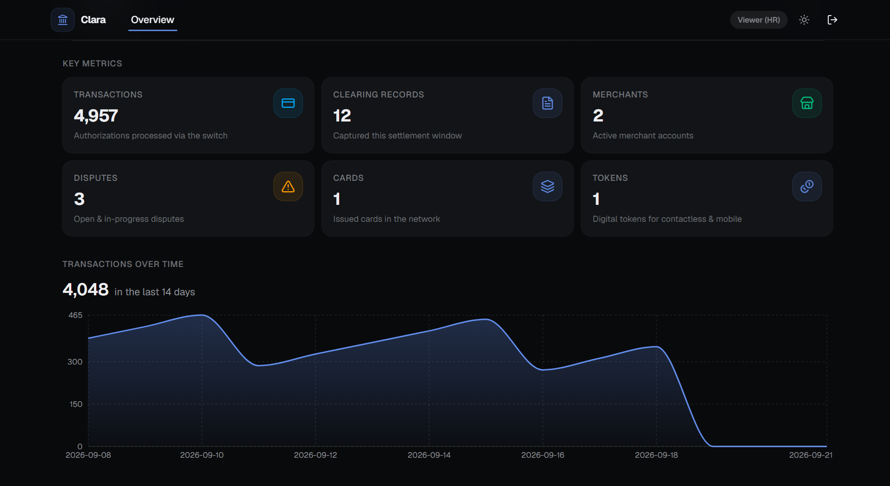 | 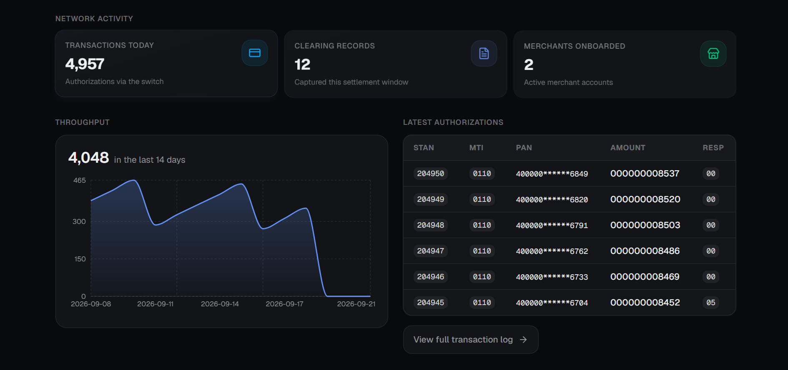 |
| **Overview** (`/overview`) — the read-only viewer seat: portfolio-wide metrics without operational controls. | **Operations activity** — the live feed of what the network is doing right now. |

## Documentation library

| # | Document | What it covers |
|---|----------|----------------|
| 00 | [Documentation Index](./docs/00-README.md) | How to use the library, reading paths, coverage matrix |
| 01 | [Card Payment Ecosystem & Four-Party Model](./docs/01-card-payment-ecosystem.md) | Participants, roles, open vs closed networks, fee flows |
| 02 | [Card Numbering & Identification](./docs/02-card-numbering-and-identification.md) | PAN structure, IIN/BIN, MII, Luhn check digit, BIN sponsorship |
| 03 | [Payment Flows: Authorization, Clearing, Settlement](./docs/03-payment-flows.md) | The three phases and message exchange lifecycle |
| 04 | [ISO 8583 - Card-originated Interchange Messages](./docs/04-iso8583.md) | The message standard for card transaction switching |
| 05 | [ISO 20022 - Payments Messaging](./docs/05-iso20022.md) | XML message standard for interbank clearing & settlement |
| 06 | [EMV Chip & Contactless](./docs/06-emv-chip.md) | Chip card spec, cryptograms, terminal transaction flow |
| 07 | [Tokenization & Network Tokens](./docs/07-tokenization.md) | EMV payment tokens, TSP, PAR, network token services |
| 08 | [3-D Secure (EMV 3DS)](./docs/08-3ds.md) | E-commerce cardholder authentication protocol |
| 09 | [PCI DSS Compliance](./docs/09-pci-dss.md) | Security standard for the cardholder data environment |
| 10 | [Fraud Detection & Risk Management](./docs/10-fraud-risk.md) | Real-time scoring, rules, velocity, machine learning |
| 11 | [Card Scheme Developer APIs](./docs/11-apis-integration.md) | Mastercard/Visa developer platforms and integration patterns |
| 12 | [System Design: Building the Platform](./docs/12-system-design.md) | Microservices, idempotency, ledger, reconciliation, scaling |
| 13 | [Fees, Interchange & Settlement Mechanics](./docs/13-fees-interchange-settlement.md) | How money and fees actually move |
| 14 | [Glossary & Source References](./docs/14-glossary-references.md) | Terminology and research sources |
| 15 | [Payment System Governance & Regulation](./docs/15-payment-system-governance-regulation.md) | Licensing, PFMI principles, SIPS oversight |
| 16 | [Membership, Rulebook & Certification](./docs/16-membership-rulebook-certification.md) | Member tiers, sponsorship, rulebook, host/L3 certification |
| 17 | [Key Management, HSM & Message Security](./docs/17-message-security-key-management.md) | PIN blocks (ISO 9564), HSMs, MACs, key hierarchy |
| 18 | [Settlement & Liquidity Infrastructure](./docs/18-settlement-liquidity-infrastructure.md) | RTGS accounts, prefunding, net/gross settlement, default fund |
| 19 | [Stand-In Processing & Availability](./docs/19-stand-in-processing-availability.md) | Stand-in rules, response codes 91/P, operational resilience |
| 20 | [Disputes, Chargebacks & Arbitration](./docs/20-disputes-chargeback-management.md) | Dispute lifecycle, reason codes, VCR, monitoring programs |
| 21 | [Cross-Border, FX & DCC](./docs/21-cross-border-fx-dcc.md) | FX conversion, dynamic currency conversion, cross-currency settlement |
| 22 | [Card Production & Lifecycle](./docs/22-card-production-lifecycle.md) | Personalization pipeline, EMV data, lifecycle, instant issuance |
| 23 | [Merchant Acquiring & Underwriting](./docs/23-merchant-acquiring-underwriting.md) | Boarding, MATCH/OFAC screening, MCC, reserves, monitoring |
| 24 | [Instant Payments & Real-Time Processing](./docs/24-instant-payments-rtp.md) | RTP/TIPS/Pix/UPI, prefunding, settlement models, ISO 20022 |
| 25 | [Clara Network System Design (Build Blueprint)](./docs/25-clara-network-system-design.md) | Decisive stack, module map, build phases 1–10, data flow |
| 26 | [Architecture Diagram Prompts](./docs/26-architecture-image-prompts.md) | Image-generation prompts; generated diagrams in [`docs/images/`](./docs/images/) |
| 27 | [Implementation Status](./docs/27-implementation-status.md) | What is built, tested, and released: phase-by-phase mapping to packages, sims, ports, config, divergences |

The `docs/references/` directory holds source PDFs downloaded from public
institutions (BIS/CPMI, ECB, World Bank, FDIC, OCC, Visa, Mastercard, PCI SSC,
NIST) plus a manifest tracking every needed source, including member-gated and
paywalled documents.

## Architecture

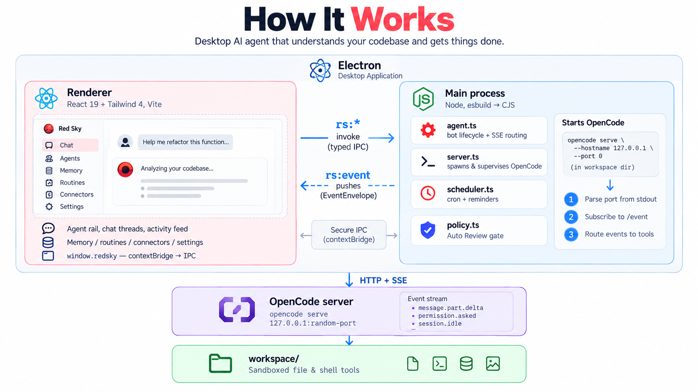

*Clara Network architecture overview.*


*End-to-end system architecture: entry points, acquirer host, Clara switch,
issuer host, and core services.*


*ISO 8583 authorization flow, including the stand-in fallback path.*


*Clearing, settlement, and liquidity: netting, prefunded accounts, default
fund, and central-bank RTGS.*


*Issuer, tokenization, and card stack: card production, HSM keys, BIN ranges,
and network tokens.*


*Security, HSM, and resilience: key hierarchy, MAC/PIN blocks, and active-active
site topology.*

The five diagrams were generated from the prompts in
[`docs/26-architecture-image-prompts.md`](docs/26-architecture-image-prompts.md).

## Building & running

Phases 1–10 implement the **authorization flow, net settlement, scheme ledger,
issuing stack, acquiring stack, disputes engine, key management,
operational resilience, and an instant-payment layer**: acquirer → switch →
(risk check) → issuer authorization with BIN-based routing, failover,
idempotent replay, in-path risk scoring, stand-in processing; a clearing
engine that captures clearing files, computes per-member net positions,
enforces prefunded caps, applies the default fund, and emits ISO 20022
pacs.009 settlement instructions; an append-only double-entry ledger that
posts every net position as a balanced journal and reconciles the ledger
against the settlement agent's statement; the issuing stack — BIN ranges,
card personalization, EMV-style ARQC cryptogram verification (with ATC
anti-replay), token vault (PAN → token + PAR), and mobile-wallet provisioning;
the acquiring stack — merchant boarding with MATCH/OFAC negative-list
screening, MCC assignment with risk tiering, and a funding engine that
withholds processing fees and rolling reserves and schedules merchant payouts;
the disputes engine — a reason-code taxonomy, the file → representment →
rule → arbitration lifecycle with fees charged to the losing party, the
associated-transaction (prior-credit) check, SLA deadline tracking, and
merchant chargeback-ratio monitoring; the key-management layer — a
Hardware Security Module simulation with dual-control key ceremonies
(M-of-N), AES key wrap (RFC 3394), TR-31-style key blocks for transport to
members, ISO 9564 PIN blocks (formats 0 and 4) verified inside the HSM,
ISO 9797-1 retail MACs with tamper detection, key rotation, a full audit
trail, and dual-control zeroize; the resilience layer — issuer stand-in
processing (SIP/STIP) with per-issuer limits and negative/valid-card files,
per-route circuit breakers with half-open probing (primary → secondary →
stand-in → decline), outcome metrics with approximate p99 latency, and
burst detection of issuer-inoperative (91) responses that flags an issuer
outage; and the instant-payment layer — ISO 20022 pacs.008 customer credit
transfers settled in real time, 24/7/365, against fully prefunded member
positions (the RTP model) with a 20-second scheme SLA, verify-and-reserve
settlement capacity checks, rejection reason codes (AC04/AC01/AG01/FF01),
SLA timeout handling with reservation release (NOAS), and pacs.002 status
reports. It requires Go 1.26+ and Docker Desktop (Linux containers enabled).

```sh
# unit + integration tests (run on Linux — Windows has AppLocker/Defender
# blocks on unsigned test binaries)
go test ./...

# or run tests inside a Linux container
docker build --target test -t clara-network-test .

# run the full stack using Docker (postgres, redis, switch, issuer-sim,
# acquirer-sim, clearing-sim, ledger-sim, cardsvc, card-sim, acquiring-sim,
# disputes-sim, hsm-sim, resilience-sim, instant-sim): 6 auth requests with BIN routing and a velocity rule that
# declines the 6th with response code 59, then a settlement cycle with a
# member default covered by the default fund, a clean ledger + reconciliation
# run, the issuing stack demo (cryptogram verify, tokenize, provision), the
# acquiring stack demo (boarding decisions, fee/reserve funding, reserve
# release), the disputes demo (representment rulings, arbitration,
# associated-transaction rejection, chargeback ratios), the HSM demo
# (key ceremonies, PIN verify, retail MAC + tamper detection, key rotation,
# audit trail, zeroize), the resilience demo (failover to a secondary
# issuer, circuit-breaker trip, stand-in approvals/declines, 91-burst alert,
# half-open probe recovery), and the instant-payments demo (pacs.008 in ->
# ACSC/RJCT out, prefunded positions, SLA timeout with reservation release,
# position conservation)
docker compose -f deploy/docker-compose.yml up --build
docker compose -f deploy/docker-compose.yml logs switch acquirer-sim clearing-sim ledger-sim card-sim acquiring-sim disputes-sim hsm-sim resilience-sim instant-sim

# or run locally: terminal 1 -> switch, terminal 2 -> issuer-sim,
# terminal 3 -> acquirer-sim, terminal 4 -> clearing-sim, terminal 5 -> ledger-sim,
# terminal 6 -> cardsvc, terminal 7 -> card-sim, terminal 8 -> acquiring-sim,
# terminal 9 -> disputes-sim, terminal 10 -> hsm-sim, terminal 11 -> resilience-sim,
# terminal 12 -> instant-sim
go run ./cmd/switch
go run ./cmd/issuer-sim
go run ./cmd/acquirer-sim
go run ./cmd/clearing-sim
go run ./cmd/ledger-sim
go run ./cmd/cardsvc
go run ./cmd/card-sim
go run ./cmd/acquiring-sim
go run ./cmd/disputes-sim
go run ./cmd/hsm-sim
go run ./cmd/resilience-sim
go run ./cmd/instant-sim
```

### Admin API

The Admin API is a read-only REST service (`:8083`) that queries the shared PostgreSQL
schema to power dashboards, reporting, and operational visibility.

```sh
# start the admin API (requires CLARA_PG_DSN)
go run ./cmd/adminapi

# Docker stack already includes it at http://localhost:18083
```

| Endpoint | Description |
|----------|-------------|
| `GET /health` | Liveness probe |
| `GET /api/v1/dashboard` | Summary counts (transactions, clearing, merchants, disputes, cards, tokens) |
| `GET /api/v1/transactions` | Switch transaction audit log (filterable by status, currency) |
| `GET /api/v1/clearing/cycles` | Clearing cycle list |
| `GET /api/v1/clearing/net-positions` | Per-member net positions |
| `GET /api/v1/settlement/instructions` | Settlement pacs.009 instructions |
| `GET /api/v1/settlement/prefunds` | Prefund account balances vs caps |
| `GET /api/v1/settlement/default-fund` | Default fund balance |
| `GET /api/v1/ledger/accounts` | Double-entry ledger accounts + computed balances |
| `GET /api/v1/ledger/journal-entries` | Journal entry lines for each account |
| `GET /api/v1/cards` | Issued cards (masked PAN, status, product, ATC) |
| `GET /api/v1/bin-ranges` | BIN range assignments |
| `GET /api/v1/tokens` | Network tokens (PAR, device, requestor) |
| `GET /api/v1/merchants` | Boarded merchants (MCC, risk tier, reserves, limits) |
| `GET /api/v1/funding-lines` | Merchant funding line balances |
| `GET /api/v1/disputes` | Disputes (reason code, stage, status, evidence, fees) |
| `GET /api/v1/disputes/overdue` | Disputes past SLA deadline |
| `GET /api/v1/disputes/chargeback-ratio` | Chargeback ratio by merchant |

Key config (via env):

- `CLARA_ISSUER_ROUTES` — JSON `{receiving-institution-id:
  host:port}`; a value may be a comma-separated failover list.
- `CLARA_BIN_TABLE` — JSON `{"entries":{"400000":"1000001000"}}` routes by
  PAN BIN when the message omits DE100.
- `CLARA_RISK_RULES` — JSON rule set; velocity counters (per card / per
  merchant) are counted in Redis and can decline with a configurable code.
- `CLARA_REDIS_ADDR` — idempotency + risk counters.
- `CLARA_PG_DSN` — audit log, clearing records, net positions, prefund
  accounts, default fund.
- `CLARA_SEND_DE100=false` (acquirer-sim) — omit DE100 to exercise BIN routing.
- `CLARA_SCENARIO` (clearing-sim) — `default` (prefund covers) or `default`
  run with a member default; settlement pacs.009 XML is written to
  `CLARA_OUT` (default `out/clearing`).
- `CLARA_MISMATCH` (ledger-sim) — when set, corrupts the settlement agent's
  statement to demonstrate reconciliation classification (amount mismatch and
  orphan-in-ledger).
- `CLARA_ISSUER_MASTER_KEY` (cardsvc/card-sim) — 16-byte AES master key for
  per-card key derivation and cryptogram verification.
- `CLARA_BIN`, `CLARA_PAN`, `CLARA_PRODUCT` (cardsvc/card-sim) — issued BIN
  range and the PAN to personalize; `CLARA_DEVICE_ID`, `CLARA_TRID` for
  wallet provisioning.
- `CLARA_LISTEN` (cardsvc) — HTTP listen address (default `:8081`); the REST
  API exposes `POST /cards`, `POST /cards/{ref}/arqc`,
  `POST /cards/{ref}/verify-arqc`, `POST /tokens`, `GET /tokens/{token}`,
  `POST /tokens/{token}/provision`.
- `CLARA_PG_DSN` (acquiring-sim) — persists merchants, funding lines, and the
  MATCH/OFAC screening lists; without it the demo uses an in-memory store.
- `CLARA_PG_DSN` (disputes-sim) — persists dispute cases and monitored
  transactions; without it the demo uses an in-memory store.
- `CLARA_PG_DSN` (hsm-sim) — not used; the HSM simulation is fully in-process
  (keys, ceremonies, and the audit trail live inside the HSM and are wiped on
  exit or via a dual-control `Zeroize`).
- `CLARA_PG_DSN` (resilience-sim) — not used; the chaos drill runs fully
  in-process: a switch fronts a primary and a secondary issuer on localhost,
  then the primary dies (circuit breaker trips, traffic fails over), the
  secondary dies too (stand-in approves within limits, declines hot cards and
  restricted BINs, and issues 91s that trip a burst alert), and finally the
  primary recovers (a half-open probe re-closes the circuit).
- `CLARA_PG_DSN` (instant-sim) — not used; the instant-payment demo runs fully
  in-process: pacs.008 credit transfers settle in real time against
  prefunded positions with a 20-second SLA, and rejections (AC04/AC01/AG01/
  FF01/NOAS) never move funds. The SLA shown for the timeout drill is
  configurable (`CLARA_INSTANT_SLA`, default `3s`) so the drill does not wait
  twenty seconds.

### Web admin console

A read-only Next.js dashboard (`web/`) sits on top of the Admin API. It uses a
BFF (`/api/data/*`) that authenticates the user via Supabase, enforces a
role allow-list, and proxies to the Go `adminapi`. Hosting is CLI-only:
Next.js on **Vercel**, PostgreSQL + Auth on **Supabase**, and the Go
`adminapi` on **Railway**.

To try it, open the live console and pick a persona:

```
https://clara-network.vercel.app/login
```

The login screen is a persona dropdown — choose **Scheme Operator**, **Issuer**,
**Acquirer**, **Merchant**, or **Viewer** and it signs you in immediately with
that role's demo credentials (common password `ClaraDemo!2026`, provisioned by
`npm run db:users`). See [`web/README.md`](./web/README.md) for the demo matrix,
local setup, and the full cloud deploy runbook.

### Live demo (cloud)

A fully deployed, one-click sandbox is running:

- **Web console** — https://clara-network.vercel.app (Next.js on Vercel)
- **Admin API** — https://adminapi-production-efd2.up.railway.app (Go on Railway)
- **Database + Auth** — Supabase project `clara-network`

The database runs on Supabase's free plan, which pauses a project after 7 days
without activity. A paused project takes the whole demo down with it: the
database stops resolving and every Admin API data route returns a 500. A daily
[`keepalive`](./.github/workflows/keepalive.yml) workflow pings the database and
the Admin API — both to reset that timer and to fail loudly if the demo dies,
so an outage surfaces as a failing workflow instead of rotting unnoticed. The
console also degrades gracefully: when the Admin API is unreachable or returns
an error, every dashboard page falls back to realistic mock data (see
`web/src/lib/mock-data.ts`) instead of blanking out, so the demo stays
navigable. A paid Supabase plan is the only hard guarantee, since paid
projects cannot be paused.

Log in by picking a persona — no typing. See
[`web/README.md`](./web/README.md) for the full matrix and deploy runbook.

### Smoke testing

`make smoke` (or `scripts/smoke.sh`) is a one-click end-to-end smoke test that
boots the full docker-compose stack, seeds data, and verifies all three tiers
against live services — the PostgreSQL schema + seed rows, every `adminapi`
endpoint, and the frontend (a production `next build` plus runtime probes of
the auth middleware and the BFF auth guard). It prints a PASS/FAIL table and
exits non-zero on any failure. See [`docs/smoke-testing.md`](./docs/smoke-testing.md).

## Status

Research & specification library (docs 00–27), phase 1 (ISO 8583 switch),
phase 2 (authorization flow with BIN routing, risk, failover), phase 3
(clearing + net settlement with prefunding, default fund, pacs.009), phase 4
(append-only double-entry ledger + reconciliation against the settlement
statement), phase 5 (issuing stack: BIN ranges, card personalization, EMV ARQC
verification, token vault, wallet provisioning), phase 6 (acquiring stack:
merchant boarding with MATCH/OFAC screening, MCC risk tiering, fee/reserve
funding), phase 7 (disputes engine: reason codes, representment,
arbitration, associated-transaction check, chargeback monitoring), phase 8
(key management & security: HSM simulation, dual-control key ceremonies, AES
key wrap, PIN blocks, retail MACs, key rotation, audit, zeroize), phase 9
(operational resilience: stand-in processing with per-issuer limits and
negative/valid-card files, per-route circuit breakers with half-open probing,
outcome metrics and p99 latency, 91-burst outage detection, and a chaos
drill), and phase 10 (instant payments: ISO 20022 pacs.008 customer credit
transfers settled in real time, 24/7/365, against fully prefunded member
positions with a 20-second SLA, verify-and-reserve settlement capacity
checks, rejection reason codes, SLA timeout handling with reservation
release, and pacs.002 status reports) implemented. All ten blueprint phases
are complete. The Admin API (read-only REST at `:8083`) provides full
operational visibility across all services: transactions, clearing,
settlement, ledger, cards, tokens, merchants, and disputes — ready for
connecting dashboards and monitoring tools.

A **web admin console** (`web/`) is built and deployed to the cloud (Vercel +
Supabase + Railway) with a one-click persona login, and `make smoke` verifies
the full stack end to end.

**v0.1.0-beta** — all ten blueprint phases are implemented, `make smoke`
verifies the stack end to end, and the demo is live at
https://clara-network.vercel.app. No load or capacity testing has been run, so
treat the deployment as a functional sandbox rather than a capacity claim.
Contributions are welcome — see [`CONTRIBUTING.md`](./CONTRIBUTING.md) and the
[`ROADMAP.md`](./ROADMAP.md) for where help is most useful.

## Contributing

Contributions are welcome — issues, docs, and pull requests alike. Start with
[`CONTRIBUTING.md`](./CONTRIBUTING.md) for setup and the reviewable-PR bar, and
[`docs/28-contributor-architecture-guide.md`](./docs/28-contributor-architecture-guide.md)
for where the code lives. Roadmap work is tracked in [`ROADMAP.md`](./ROADMAP.md).
Please read the [`Code of Conduct`](./CODE_OF_CONDUCT.md); it applies to every
project space.

## Security

Clara Network is a simulator and must not be connected to real card
infrastructure, but it implements real key-management and message-security
machinery worth respecting. Please report vulnerabilities privately per
[`SECURITY.md`](./SECURITY.md) rather than in a public issue.

## License

[MIT](./LICENSE) — see the LICENSE file for details.
